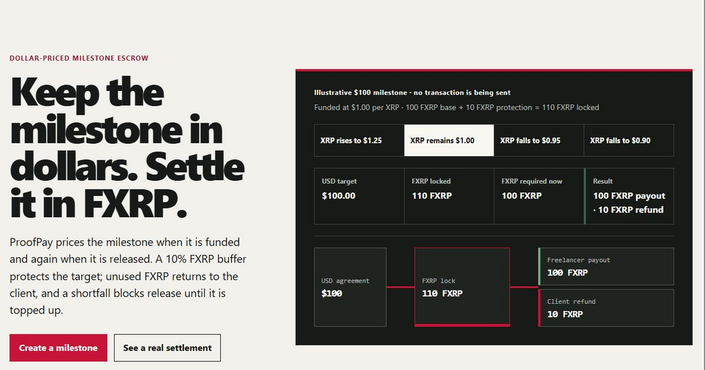

# ProofPay



Keep a freelance milestone priced in dollars while settling it in FXRP.

## Live project

- Production: [proofpay.paysmat.xyz](https://proofpay.paysmat.xyz)
- Demo video: [ProofPay — Flare Summer Signal Demo](https://youtu.be/EFg1fmcIYb0)
- Create a milestone: [proofpay.paysmat.xyz/app](https://proofpay.paysmat.xyz/app)
- Network: Flare Testnet Coston2, chain ID `114`
- Contract: [`0x53bE2D49f4bFCF2cc04A225Ccb7398Fb5E5EAA21`](https://coston2-explorer.flare.network/address/0x53bE2D49f4bFCF2cc04A225Ccb7398Fb5E5EAA21)
- Real records: [invoice 1](https://proofpay.paysmat.xyz/invoice/1), [receipt 1](https://proofpay.paysmat.xyz/receipt/1), [invoice 2](https://proofpay.paysmat.xyz/invoice/2), [receipt 2](https://proofpay.paysmat.xyz/receipt/2)
- Source: [github.com/Samfresh-ai/proofpay](https://github.com/Samfresh-ai/proofpay)

The landing-page scenarios are explicitly illustrative and send no transaction.
The two invoices and receipts above are read from already-settled Coston2
records.

## Problem

A freelancer may quote work in dollars while a client funds with a volatile
crypto asset. If the asset falls before release, the freelancer can be
short-paid; if it rises, unnecessary value can remain locked. Both parties also
need inspectable evidence of what was agreed, funded, delivered, and settled.

ProofPay is a one-milestone escrow prototype for freelancers, small digital
service providers, and their clients. It keeps the agreement denominated in USD
while the contract accounts and settles in FXRP.

## Product flow

1. The freelancer creates a USD-priced milestone with a named client, delivery
   deadline, and scope commitment.
2. A fresh FTSOv2 XRP/USD price determines the FXRP required for the target.
   The client funds that amount plus a fixed 10% protection buffer.
3. The freelancer submits a nonzero evidence-manifest commitment and a bounded
   public URI.
4. At release, the contract reads XRP/USD again. If the lock covers the full
   dollar target, the freelancer is paid and the exact surplus is refunded.
5. If the lock is insufficient, release transfers nothing and the client must
   top up before trying again. A funded, unsubmitted invoice can instead be
   refunded strictly after its deadline.

Financial actions are simulated before the connected wallet is asked to
approve or send them. ProofPay never stores a wallet private key.

## Why Flare

- **FXRP** is the programmable XRP-derived asset locked, paid, and refunded by
  the escrow.
- **FTSOv2** supplies the on-chain XRP/USD observation used to price the same
  dollar target at funding and release.
- **Coston2** supplies public testnet transactions, verified contract source,
  and independently inspectable settlement receipts.

Without both FXRP and FTSOv2, the contract could not settle XRP-derived value
against a dollar-denominated promise without trusting an application-side
conversion.

## Architecture

```text
Freelancer / Client wallet
        │
        ▼
Next.js application ── browser-local transaction journal
        │
        ▼
ProofPayEscrow on Coston2
   ├── FXRP token
   └── FTSOv2 XRP/USD feed
        │
        ▼
Decoded public settlement receipt
```

The web application prepares role-aware wallet intents with wagmi and viem.
`ProofPayEscrow.sol` is the settlement authority. Preserved transaction
locators let the receipt route decode exact lifecycle events without presenting
the browser journal as a chain indexer.

See [the architecture guide](docs/ARCHITECTURE.md) for the trust boundaries,
state machine, settlement math, receipt model, and limitations.

## Real Coston2 evidence

Both preserved invoices completed `CREATED → FUNDED → SUBMITTED → RELEASED`:

| Proof | USD target | Locked FXRP | Payout | Refund | Final liabilities |
| --- | ---: | ---: | ---: | ---: | ---: |
| [Invoice 1](https://proofpay.paysmat.xyz/invoice/1) / [receipt](https://proofpay.paysmat.xyz/receipt/1) | $5.00 | 5.299945 | 4.818748 | 0.481197 | 0 |
| [Invoice 2](https://proofpay.paysmat.xyz/invoice/2) / [receipt](https://proofpay.paysmat.xyz/receipt/2) | $2.00 | 2.126887 | 1.933309 | 0.193578 | 0 |

In each receipt, payout plus refund equals the prior lock. The verifier checks
the expected lifecycle event in every recorded transaction and reconciles the
current invoice state, active liabilities, and contract FXRP balance. An
evidence commitment proves exact bytes, not the truth or quality of the work.

The concise [evidence guide](docs/EVIDENCE.md) maps the deployment, transaction
links, machine-readable records, tests, and proof limitations.

## Contract and deployment

- Deployment transaction: [`0xa223…f93a`](https://coston2-explorer.flare.network/tx/0xa223570423d92e6dc972452ff00da35c2d59d5c0c4c9f3a971e7cd6dabf5f93a)
- FXRP: [`0x0b6A…3dc7`](https://coston2-explorer.flare.network/address/0x0b6A3645c240605887a5532109323A3E12273dc7)
- FTSOv2: `0xC4e9c78EA53db782E28f28Fdf80BaF59336B304d`
- XRP/USD feed ID: `0x015852502f55534400000000000000000000000000`
- Compiler: Solidity `0.8.25`, optimizer `200`, via IR, Cancun EVM
- Deployment block: `33775801`; source verified on the Coston2 explorer

The constructor pins chain ID `114`, six-decimal FXRP, the XRP/USD feed, and a
30-second maximum price age. The contract has no owner, admin, rescue,
arbitrary-recipient, or unrestricted-withdrawal method.

See [the deployment guide](docs/DEPLOYMENT.md) for the public routes, runtime
inputs, verification details, and testnet warning.

## Repository layout

```text
app/          Next.js routes
components/   wallet, invoice, action, and receipt UI
lib/          data adapters, policy, intents, and journal logic
contracts/    Solidity source, Foundry scripts, fuzz, and invariant tests
artifacts/    committed runtime receipt locators and machine evidence
deployment/   Coston2 deployment record
docs/         architecture, deployment, evidence, and attribution
e2e/          deterministic and explicitly separated live browser tests
scripts/      reconciliation, verification, deployment, and probe tools
tests/        web unit tests
```

## Local setup

Requirements: Node.js `22`, npm, Git, and Foundry for Solidity checks.

```bash
git clone https://github.com/Samfresh-ai/proofpay.git
cd proofpay
git submodule update --init
npm ci
npm run dev
```

Open `http://localhost:3000`. The default mode makes read-only calls to the
official public Coston2 RPC. No private key or `.env` file is required to view
the settled invoices and receipts. A wallet is required only for an explicit
wallet action. Do not use real funds.

For a production build with canonical metadata:

```bash
NEXT_PUBLIC_SITE_URL=https://proofpay.paysmat.xyz npm run build
npm run start
```

## Tests

Frontend and data-boundary checks:

```bash
npm run lint
npm run typecheck
npm run test:unit
npm run build
npx playwright install chromium
npm run test:e2e
npm run test:e2e:production
npm run scan:browser-secrets
```

Foundry checks, including fuzz and invariant suites:

```bash
cd contracts
forge fmt --check
forge build --force
forge test
```

Read-only invoice reconciliation:

```bash
npm run reconcile:interface:coston2
```

The repository also retains narrow live-flow tools. Commands named
`deploy:coston2`, `live:coston2`, `probe:flare`, and
`test:e2e:browser-live` can use owner-controlled wallets or write evidence;
review their source and configuration before running them.

## Attribution

ProofPay's original source is MIT licensed. The contract imports pinned Flare,
OpenZeppelin, and forge-std dependencies under their own licenses. The official
FAssets demo was inspected for reference patterns only; no source file or code
fragment from it was copied or materially adapted.

Exact pins, license findings, and the no-copy decision are in
[the upstream record](docs/UPSTREAM.md).

## Limitations

- Coston2 FXRP and C2FLR are test assets with no represented real-world value.
- No audit, production-security review, human-usability study, or WCAG
  certification has been completed.
- There is no mediator, arbitration, automatic release, or forced release. A
  client can leave a submitted invoice locked by refusing release.
- ProofPay is not legal escrow and provides no fiat or bank settlement.
- An evidence commitment proves exact bytes, not delivery truth or work quality.
- The transaction journal is browser-local, not cross-device coordination or a
  generic chain indexer.
- Only invoices 1 and 2 have preserved decoded receipt locators.
- This is a hackathon prototype and is not production-ready.

## Roadmap

- Add an optional mediator or time-bounded resolution path.
- Support multiple milestones while preserving per-milestone liabilities.
- Complete independent review and mainnet hardening before any real-asset use.
- Add FDC-backed XRP redemption proof.
- Add notifications and safe cross-device journal coordination.

## Contact

[paysmat@paysmat.xyz](mailto:paysmat@paysmat.xyz)
