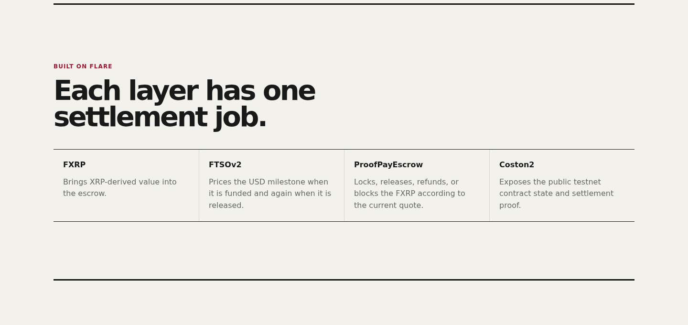

# ProofPay architecture

ProofPay is a single-milestone, USD-denominated escrow prototype that settles
in FXRP on Flare Testnet Coston2.



## System overview

```text
Freelancer / Client wallet
        │
        ▼
Next.js application
   ├── direct Coston2 reads
   ├── role-aware wallet actions
   ├── browser-local transaction journal
   └── receipt reconstruction
        │
        ▼
ProofPayEscrow
   ├── FXRP token transfers
   └── FTSOv2 XRP/USD observations
        │
        ▼
Public events and decoded settlement receipt
```

| Component | Responsibility | Trust boundary |
| --- | --- | --- |
| Freelancer wallet | Creates an invoice and submits the evidence commitment | Can act only as the invoice's freelancer; cannot move locked FXRP |
| Client wallet | Funds, tops up, releases, or reclaims an unsubmitted expired invoice | Release remains an explicit client decision |
| Next.js application | Reads chain state, prepares bounded intents, and explains outcomes | Presentation and simulation do not replace contract authorization |
| Browser transaction journal | Prevents accidental same-browser replay and reconciles submitted hashes | Local safety memory, not a chain indexer or cross-device lock |
| `ProofPayEscrow` | Enforces roles, lifecycle, price checks, rounding, and liabilities | Sole settlement authority |
| FXRP | Asset locked, paid, and refunded with `SafeERC20` | Immutable token address fixed at deployment |
| FTSOv2 | Supplies XRP/USD value, decimals, timestamp, and fee preflight | Every price-dependent action fails closed on a bad, costly, or stale read |
| Evidence manifest | Carries a public URI and completion note | Raw bytes are hash-bound; the contract does not judge their truth or quality |

Wallets sign their own transactions. ProofPay never receives or stores a
private key, mnemonic, or seed phrase.

## Deployed contract

`contracts/src/ProofPayEscrow.sol` is deployed and source-verified at
[`0x53bE2D49f4bFCF2cc04A225Ccb7398Fb5E5EAA21`](https://coston2-explorer.flare.network/address/0x53bE2D49f4bFCF2cc04A225Ccb7398Fb5E5EAA21).
The constructor requires Coston2 chain ID `114` and stores four immutable
dependencies:

- FXRP: `0x0b6A3645c240605887a5532109323A3E12273dc7`
- FTSOv2: `0xC4e9c78EA53db782E28f28Fdf80BaF59336B304d`
- XRP/USD feed ID: `0x015852502f55534400000000000000000000000000`
- 30-second maximum price age

The deployment script resolves current Coston2 addresses through the official
Flare Contract Registry, checks code and FXRP decimals, and passes the resolved
addresses explicitly. The contract does not perform mutable registry lookups
during settlement.

There is no owner, admin, upgrade, pause, fee, treasury, rescue, arbitrary
recipient, or unrestricted withdrawal path. Unsolicited FXRP is inert and is
not counted as an active invoice liability.

## Invoice lifecycle

```text
CREATED ──fund──▶ FUNDED ──submit evidence──▶ SUBMITTED ──release──▶ RELEASED
   │                 │                           │
   └──cancel────────▶ CANCELLED                  └──top up──▶ SUBMITTED
                     │
                     └──refund after deadline──▶ REFUNDED
```

`CANCELLED`, `REFUNDED`, and `RELEASED` are terminal. A release quote may
derive `TOP_UP_REQUIRED`, but that is not stored as a contract status. If the
current lock is insufficient, `release` reverts before any transfer or state
change.

| Current state | Action | Authorized caller | Result |
| --- | --- | --- | --- |
| none | `createInvoice` | Caller becomes freelancer | `CREATED` |
| `CREATED` | `fundInvoice` | Named client | `FUNDED` |
| `CREATED` | `cancelBeforeFunding` | Freelancer | `CANCELLED` |
| `FUNDED` | `submitEvidence` | Freelancer | `SUBMITTED` |
| `FUNDED` | `refundUnsubmittedAfterDeadline` | Named client, strictly after deadline | `REFUNDED` |
| `SUBMITTED` | `topUp` | Named client | remains `SUBMITTED` |
| `SUBMITTED` | `release` | Named client | `RELEASED` |

The MVP has no timeout or dispute path from `SUBMITTED`. A client that refuses
release can leave the invoice locked.

## Price and settlement math

FXRP and USD targets use six-decimal atomic integers. FTSOv2 price decimals are
handled explicitly; financial calculations do not convert through JavaScript
or Solidity floating point.

For a positive XRP/USD price, the contract uses upward division:

```text
required FXRP = ceil(USD target × 10^priceDecimals / XRP-USD price)
protection    = ceil(required FXRP / 10)
funding lock  = required FXRP + protection
```

At release, `required FXRP` is recomputed from a fresh observation:

- if `locked >= required`, the freelancer receives `required` and the client
  receives `locked - required`;
- if `locked < required`, no transfer occurs and the exact shortfall is the
  required top-up.

The contract rejects zero, negative-decimal, future, stale, or unsupported-fee
FTSO results. Quote deadlines bind the observed price identity used by a wallet
intent. Aggregate active liabilities are incremented when FXRP enters an active
invoice and decremented before terminal transfers.

## Wallet application

The application reads Coston2 with viem and prepares actions with wagmi. Policy
is derived from the connected account, invoice role, current status, deadline,
and release quote. Before a wallet opens, the interface shows the exact action,
contract, account, invoice, token amount, maximum accepted amount, expected
result, and intent hash.

The browser-local transaction journal records a canonical intent identity and
the states `prepared`, `awaiting_wallet`, `submitted`, `confirmed`, `reverted`,
or `abandoned`. It provides three safety properties:

1. an exact confirmed one-time action cannot be prepared again in that browser;
2. an unresolved submitted top-up blocks any later top-up for the same
   chain/contract/account/invoice scope before allowance or approval work;
3. an ambiguous post-wallet-open failure remains fail-closed instead of
   re-enabling a potentially broadcast intent.

Only an explicit wallet rejection can return an unsigned intent to a signable
state. The journal is not shared between browsers or devices, so authoritative
contract state remains the final source of truth.

## Receipt verification

The application does not claim to discover arbitrary historical transactions.
It retains locators for invoices `1` and `2`, then verifies each receipt from
public chain data:

1. pin a Coston2 block for a consistent snapshot;
2. fetch each recorded transaction receipt;
3. require success, the deployed contract address, the expected event name,
   invoice ID, and decoded event fields;
4. hash the preserved scope and evidence manifest bytes and compare them with
   the on-chain commitments;
5. reconcile payout plus refund with the prior lock;
6. read the current invoice, aggregate active liabilities, and contract FXRP
   balance at the pinned block.

The eight runtime locator/manifest files are listed in
[the evidence guide](EVIDENCE.md). They are committed because production receipt
rendering depends on their exact paths. They provide transaction discovery and
off-chain byte commitments; values shown as current are still read from
Coston2.

## Testing and invariants

Foundry tests cover roles, transitions, deadlines, rounding, FTSO rejection,
fee preflight, transfer-delta checks, reentrancy, solvency, conservation, fuzzed
financial properties, and stateful invariants. Web unit and deterministic
browser tests cover data boundaries, wallet policy, intent replay, repeated
top-ups, ambiguous wallet outcomes, hydration, accessibility, keyboard use,
and responsive layout.

Key contract invariants include:

- a successful payout meets or exceeds the USD target under the accepted price;
- payout plus refund equals the prior lock;
- active liabilities never exceed the contract FXRP balance;
- a failed release changes neither state nor token balances;
- terminal invoices cannot be acted on again.

These automated checks are not an audit or a production-security review.

## Current limitations

- Coston2 and FTestXRP only; no mainnet deployment or real-value asset claim.
- One milestone per invoice and one immutable FXRP/FTSO configuration.
- No mediator, arbitration, forced release, or automatic resolution.
- Browser-local replay protection is not cross-device coordination.
- Only two released invoices have preserved decoded receipt locators.
- Evidence commitments prove bytes, not delivery truth or quality.
- No audit, legal-escrow status, fiat settlement, human-usability validation,
  or production-readiness claim.
